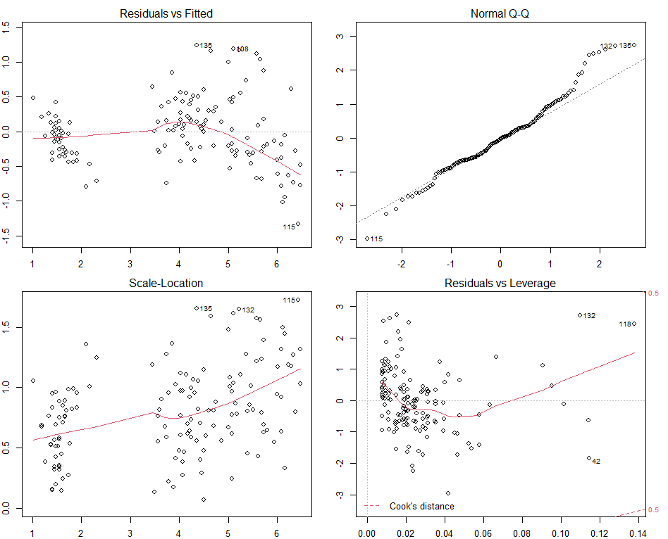

# myLM
Implementing Linear Regression Model

<!-- Badges Start -->
[](https://github.com/wjhlang/myLM/actions)
[](https://codecov.io/gh/wjhlang/myLM)
<!-- Badges End -->


## Overview
myLM is a package implementing the original lm function, its `myLM()` function aims to generate the same output as the original `lm()` function with minimal optimization that can output the model with interaction terms which the originical function don't.   
Ordinary least squares or weighted least squares can be used in the function depending on your choice, and the current only supported method is QR decomposition.

## Installation
```
devtools::install_github("wjhlang/myLM")
library(myLM)
```
## Usage
```{r}
library(myLM)
data("iris")

# Output call and coefficients
myLM(Petal.Length~Petal.Width*Sepal.Width,data = iris)

#> Call:
#> myLM(formula = Petal.Length ~ Petal.Width * Sepal.Width, data = iris)
#> 
#> Coefficients:
#>            (Intercept)              Petal.Width              Sepal.Width  Petal.Width:Sepal.Width  
#>               2.281814                 2.132570                -0.362079                 0.007197  

# Output call and coefficients for weighted least squares
myLM(Petal.Length~Petal.Width*Sepal.Width, data = iris, weight = runif(nrow(iris)))

#> Call:
#> myLM(formula = Petal.Length ~ Petal.Width * Sepal.Width, data = iris, 
#>     weights = runif(nrow(iris)))
#> 
#> Coefficients:
#>            (Intercept)              Petal.Width              Sepal.Width  Petal.Width:Sepal.Width  
                   2.7005                   1.7060                  -0.4761                   0.1356 

# Output the summary
lmod = myLM(Petal.Length~Petal.Width*Sepal.Width,data = iris)
summary(lmod)

#> Call:
#> myLM(formula = Petal.Length ~ Petal.Width * Sepal.Width, data = iris)
#> 
#> Residuals:
#>      Min       1Q   Median       3Q      Max 
#> -1.33452 -0.29091 -0.01051  0.21497  1.24780 

#> Coefficients:
#>                          Estimate Std. Error t value Pr(>|t|)    
#> (Intercept)              2.281814   0.583452   3.911  0.00014 ***
#> Petal.Width              2.132570   0.481634   4.428 1.85e-05 ***
#> Sepal.Width             -0.362079   0.173239  -2.090  0.03835 *  
#> Petal.Width:Sepal.Width  0.007197   0.149522   0.048  0.96168    
#> ---
#> Signif. codes:  0 ‘***’ 0.001 ‘**’ 0.01 ‘*’ 0.05 ‘.’ 0.1 ‘ ’ 1
#> 
#> Residual standard error: 0.459 on 146 degrees of freedom
#> Multiple R-squared:  0.9338,	Adjusted R-squared:  0.9324 
#> F-statistic: 686.1 on 3 and 146 DF,  p-value: < 2.2e-16

# Output diagnostic plots
par(mfrow=c(2,2))
par(mar=c(2,2,2,2))
plot(myLM(Petal.Length~Petal.Width*Sepal.Width,data = iris))
```



